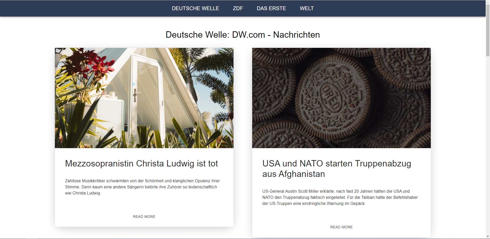

# Nachrichten

## Learn language through news

### Overview

This web app retrieves the latest news from RSS and then use cheerio.js to retrieve the content. When a user clicks on a word, it will be translated and shown using Google Translate API

### Installation

1. Follow the official Google Translate documentation to set up your own API [Google Translate](https://cloud.google.com/translate/docs/setup)

2. Run `server\run.ps1` on PowerShell

3. Run `npm start` on client\
